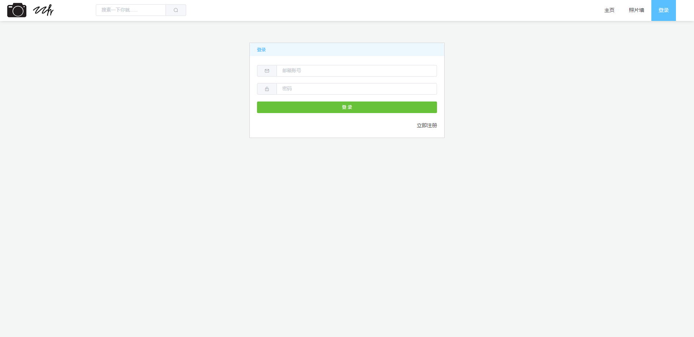
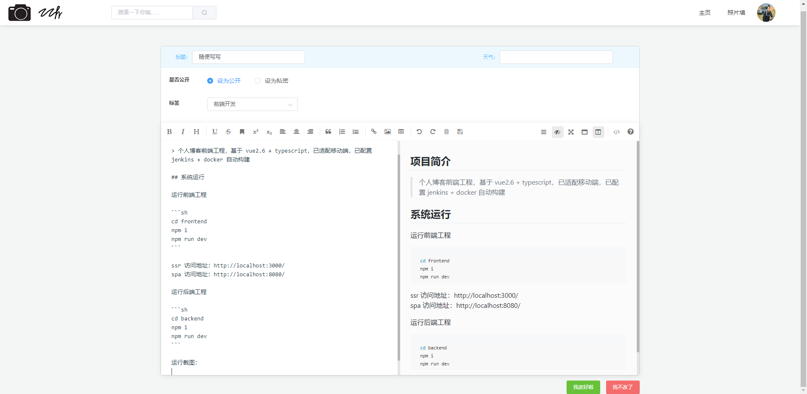
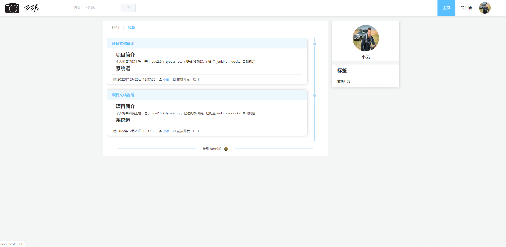
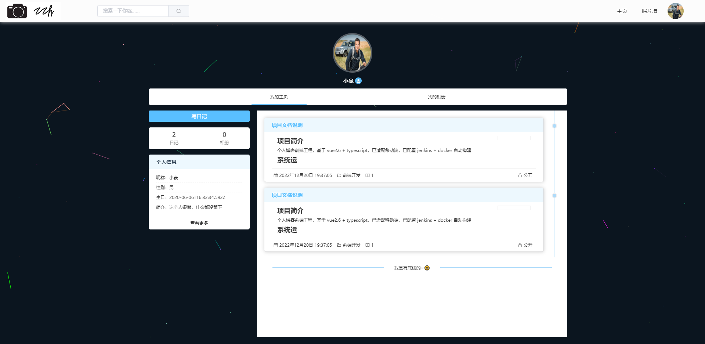

## 项目简介

> 个人博客前端工程，基于 vue2.6 + typescript，已适配移动端，已配置 jenkins + docker 自动构建

## 系统运行

运行前端工程

```sh
cd frontend
npm i
npm run dev
```

ssr 访问地址：http://localhost:3000/
spa 访问地址：http://localhost:8080/

运行后端工程

```sh
cd backend
npm i
npm run dev
```

运行截图：

登录页



文章页面



文章列表



个人中心


